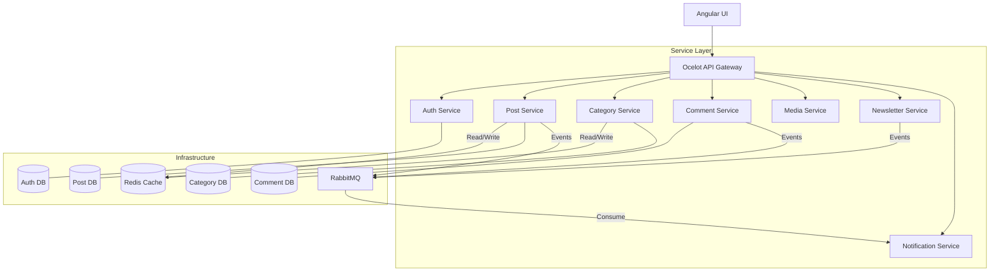
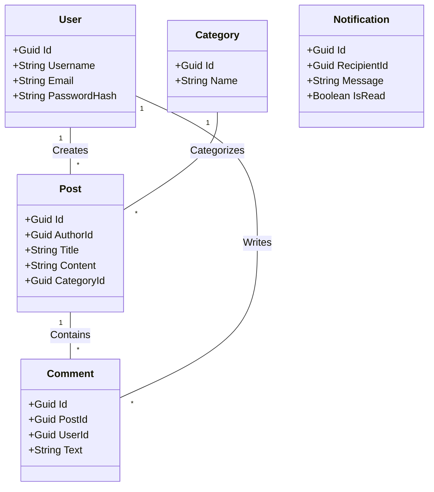
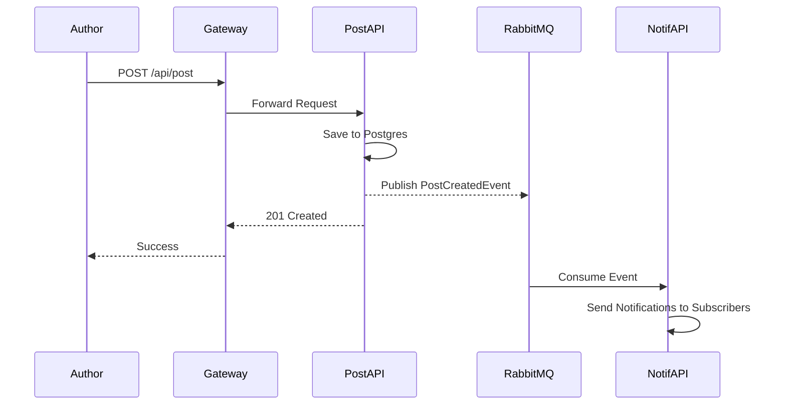

# InkWell - Microservices Blogging Platform
A Production-Grade, Event-Driven Content Ecosystem Built on .NET 8

A modern, scalable social media and blogging platform engineered with a full microservices architecture, event-driven design patterns, and a distributed backend — enabling users to create posts, manage categories, interact with content, and receive real-time notifications at scale.

[Architecture](#architecture) · [Microservices](#microservices-overview) · [API Docs](#api-documentation) · [Setup](#getting-started) · [DevOps](#devops--quality-assurance)

---

## 📌 Table of Contents
- [Tech Stack](#tech-stack)
- [Architecture Overview](#architecture)
- [UML Diagrams](#uml-diagrams)
- [Microservices Overview](#microservices-overview)
- [Inter-Service Communication](#inter-service-communication)
- [Database Schema](#database-schema)
- [Security & Resilience](#security--resilience)
- [Performance Optimizations](#performance-optimizations)
- [Getting Started](#getting-started)
- [DevOps & Quality Assurance](#devops--quality-assurance)

---

## 🛠 Tech Stack
| Layer | Technology | Purpose |
| :--- | :--- | :--- |
| **Backend** | ASP.NET Core 8 Web API | 8 independent microservices |
| **Gateway** | Ocelot API Gateway | Single entry point, routing & aggregation |
| **Database** | PostgreSQL | Per-service isolated databases (DB-per-service) |
| **Caching** | Redis | Distributed caching for posts and categories |
| **Messaging** | RabbitMQ + MassTransit | Async event-driven communication |
| **Security** | JWT (HS256) | Stateless authentication & authorization |
| **Quality** | SonarQube | Static code analysis & security auditing |
| **DevOps** | Docker & Compose | Full local orchestration & containerization |
| **Deployment** | Render.com | Cloud production environment |

---

## 📐 UML Diagrams

### 1. Use Case Diagram
All actors and core interactions across the InkWell ecosystem.

```mermaid
useCaseDiagram
    actor "Author" as A
    actor "Reader" as R
    actor "Subscriber" as S

    package "InkWell System" {
        A --> (Create/Edit Post)
        A --> (Manage Categories)
        A --> (Upload Media)
        R --> (Read Posts)
        R --> (Write Comments)
        R --> (Subscribe to Newsletter)
        S --> (Receive Notifications)
        (Write Comments) ..> (Notify Author) : <<extend>>
        (Create/Edit Post) ..> (Notify Subscribers) : <<extend>>
    }
```

### 2. System Architecture Diagram
Full deployment view — Client → API Gateway → Microservices → Infrastructure.



### 3. Entity Class Diagram
Core domain model and cross-service logical relationships.



### 4. Post Creation & Notification Flow
Sequence diagram showing how a post triggers asynchronous subscriber notifications.



---

## 📦 Microservices Overview

### 🔑 InkWell.Auth (Identity & Profiles)
The entry point for user management and security.
- **Stateless Auth:** Implements JWT-based authentication with standard claims (Name, Email, Role).
- **Profile Management:** Handles user registration, login, and avatar metadata.
- **Security:** Uses BCrypt for password hashing and enforces role-based access control (RBAC) across the ecosystem.

### 📝 InkWell.Post (Content Engine)
The core service for all blog-related operations.
- **State Machine:** Manages post lifecycles (Draft → Published → Archived).
- **Engagement:** Handles "Like" and "Unlike" logic directly, emitting events for real-time notifications.
- **Analytics:** Tracks post views and supports featuring/unfeaturing posts by admins.
- **Search:** Provides keyword-based search functionality across published content.

### 🏷️ InkWell.Category (Taxonomy)
Organizes content through a hierarchical category system.
- **Categorization:** Allows posts to be mapped to specific topics.
- **Caching:** Frequently accessed category trees are cached in Redis to minimize database lookups.

### 💬 InkWell.Comment (User Interaction)
Manages the social layer of the platform.
- **Threaded Discussions:** Supports hierarchical comments (replies to replies).
- **Event Emission:** Publishes `CommentAddedEvent` to the message bus to trigger author notifications.

### 🔔 InkWell.Notification (Event Consumer)
The central hub for real-time alerts.
- **Event Consumption:** Listens to `PostLiked`, `CommentAdded`, and `PostPublished` events via RabbitMQ.
- **History:** Stores notification history for every user, allowing them to track their engagement.

### ✉️ InkWell.Newsletter (Subscriptions)
Handles audience growth and outreach.
- **Subscription Logic:** Manages subscriber lists and email preferences.
- **Automation:** Consumes `PostPublished` events to automatically queue newsletter updates for subscribers.

### 📁 InkWell.Media (Asset Management)
The storage abstraction layer.
- **File Handling:** Manages image uploads for post content and user profiles.
- **Storage Providers:** Configurable to use local storage (via Docker volumes) or cloud providers like Azure Blob Storage.

### 🌐 InkWell.Gateway (Unified Entry)
The orchestrator for all incoming client traffic.
- **Routing:** Uses Ocelot to route requests from `http://gateway:5032/api/post/...` to the appropriate internal service.
- **Auth Forwarding:** Validates the JWT at the edge and forwards user claims to downstream services.

---

## 🔄 Inter-Service Communication

### Synchronous (HTTP REST)
Used for real-time validation and data retrieval where immediate consistency is required.
- **Gateway → Services**: All external traffic.
- **Comment Service → Post Service**: Verify post exists before adding comments.
- **Media Service → Auth Service**: Verify user permissions for file management.

### Asynchronous (RabbitMQ + MassTransit)
Used for decoupling and high availability.
- **PostCreatedEvent**: Dispatched when a post is published → Consumed by Notification/Newsletter.
- **CommentAddedEvent**: Dispatched when a user comments → Consumed by Notification.
- **UserRegisteredEvent**: Dispatched on new sign-ups → Consumed by Newsletter for onboarding.

---

## 🔐 Security & Resilience
- **Stateless Auth**: JWT-based security with HS256 signing and claims-based authorization.
- **BCrypt Hashing**: Passwords are never stored in plain text.
- **Database Isolation**: Each service owns its schema (DB-per-service), preventing cascading failures.
- **Input Validation**: Strict DTO-level validation using Data Annotations and FluentValidation.
- **Containerization**: Isolated environments for every component via Docker.

---

## ⚡ Performance Optimizations
- **Cache-Aside Pattern**: Frequently accessed posts and category lists are cached in Redis with a 10-minute TTL.
- **Eventual Consistency**: Heavy operations like notification dispatching are offloaded to background consumers.
- **Optimized Media**: Multi-stage Docker builds ensure minimal image footprints and fast cold starts.
- **Connection Pooling**: Optimized database connections for high-concurrency scenarios.

---

## 🚀 Getting Started

### Prerequisites
- .NET 8 SDK
- Docker Desktop
- PostgreSQL & Redis (if running locally)

### Option 1 — Docker Compose (Recommended)
```bash
# Clone the repository
git clone https://github.com/Yashkumar1160/InkWell.git
cd InkWell

# Start all services and infrastructure
docker-compose up --build
```
The **API Gateway** will be available at `http://localhost:5032`.

### Option 2 — Manual Execution
Each service can be run independently using `dotnet run --project <ProjectName>`. Ensure local instances of Postgres, Redis, and RabbitMQ are active.

---

## 📊 DevOps & Quality Assurance
- **SonarQube**: Continuous inspection of code quality and security.
- **Unit Testing**: NUnit and Moq are used for service-layer logic validation.
- **Integration Testing**: Postman collections provided for end-to-end API testing through the Gateway.

---

Developed with ❤️ by [Yash Kumar](https://github.com/Yashkumar1160)
